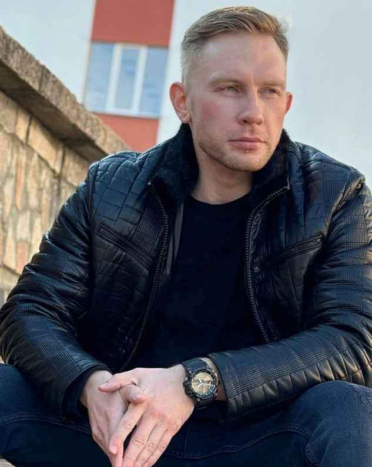

# Evgeni Karpenko
## Contacts 
+ _Location: Belarus, Gomel_
+ _mail: amay90@mail.ru_
+ _Telegram: amai90_
+ Discord: JackJeickobs (@JackJeickobs)
+ _[Instagram](https://www.instagram.com/jack_jeickobs/)_

I started studying front-end development on March 1, 2023. I study on my own in RolingScopesSchool. The material is given with difficulty, but so far everything is clear.
I devote my free time to studying this profession and I hope to become a real front-end developer in the future.
## Skill
I am currently in the learning process. Experience is gained every day.
## Completed projects
[CV](https://JackJeickobs.github.io/rsschool-cv/cv)
## Education
In 2017, I graduated from the "Belarusian Trade and Economic University of Consumer Cooperatives" with a degree in manager-economist
## English level
The level of my English according to the online test A2

+ [My GitHub 2023](https://github.com/JackJeickobs/) 
+ [Course RSS](https://rs.school/js-stage0/)

